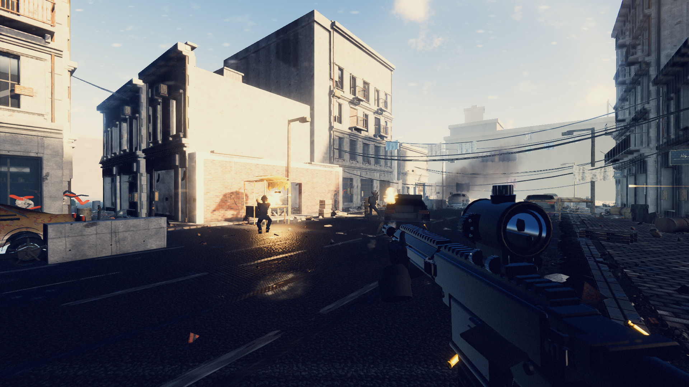

# Claude of Duty

A browser-based FPS built with [Three.js](https://threejs.org/) — every model, texture,
shader, and sound is generated in code. No external assets.



## Origin

This project started from a demo built by [Matt Shumer](https://x.com/mattshumer_) (`@mattshumer_`):

> Claude Opus 5 one-shotted this game.
>
> EVERYTHING you see in this demo is custom code... not a single external
> asset was used.
>
> AI games are going to be amazing.
>
> — [@mattshumer_, Jul 25](https://x.com/mattshumer_)

Using Matt's prompt as the starting point, this build (`@jackjackatx`) was taken further:

> After 3x 5-hour windows on the $100 Claude Code Max plan (~$600 in tokens if not
> on the Claude sub), this is what I have using @mattshumer_'s prompt! The only
> additional prompting I did was to wrap up & write progress to memory as it got
> near usage limits, & to pick up from memory to get going again on a fresh limit.
> This was a total of about 6.5 hours of Opus 5 working on it across the 3 sessions.
>
> — [@jackjackatx](https://x.com/jackjackatx)

## Development

```bash
npm install
npm run dev      # dev server at :5173
npm run build    # production build to dist/
npm run preview  # preview the production build at :4173
```

See `docs/` for the full architecture, art direction, and gameplay spec this build
was held to.

## License

MIT — see [LICENSE](LICENSE).
